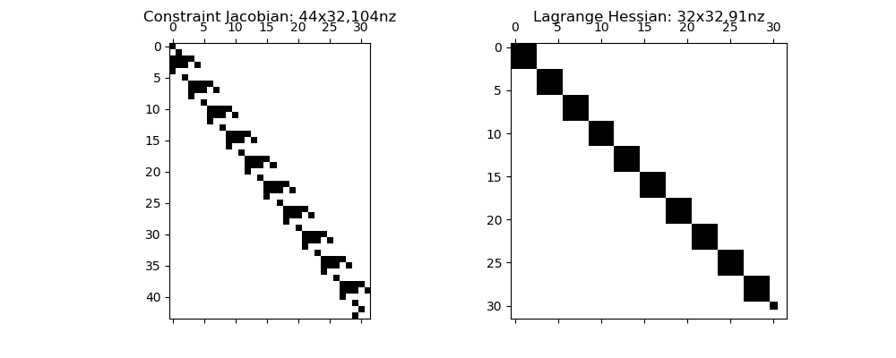

# rockit
[](https://gitlab.kuleuven.be/meco-software/rockit/commits/master)
[](https://meco-software.pages.gitlab.kuleuven.be/rockit/coverage/index.html)
[](http://meco-software.pages.gitlab.kuleuven.be/rockit)
[](http://meco-software.pages.gitlab.kuleuven.be/rockit/documentation-rockit.pdf)

# Description


Rockit (Rapid Optimal Control kit) is a software framework to quickly prototype optimal control problems (aka dynamic optimization) that may arise in engineering: e.g.
iterative learning (ILC), model predictive control (NMPC), system identification, and motion planning.

Notably, the software allows free end-time problems and multi-stage optimal problems.
The software is currently focused on direct methods and relies heavily on [CasADi](http://casadi.org).
The software is developed by the [KU Leuven MECO research team](https://www.mech.kuleuven.be/en/pma/research/meco).

# Installation
Install using pip: `pip install rockit-meco`

# Hello world
(Taken from the [example gallery](https://meco-software.pages.gitlab.kuleuven.be/rockit/examples/))

You may try it live in your browser: [](https://mybinder.org/v2/git/https%3A%2F%2Fgitlab.kuleuven.be%2Fmeco-software%2Frockit.git/v0.1.9?filepath=examples%2Fhello_world.ipynb).

Import the project:
```python
from rockit import *
```

Start an optimal control environment with a time horizon of 10 seconds
starting from t0=0s.
_(free-time problems can be configured with `FreeTime(initial_guess))_
```python
ocp = Ocp(t0=0, T=10)
```

Define two scalar states (vectors and matrices also supported)
```python
x1 = ocp.state()
x2 = ocp.state()
```

Define one piecewise constant control input
_(use `order=1` for piecewise linear)_
```
u = ocp.control()
```

Compose time-dependent expressions a.k.a. signals
_(explicit time-dependence is supported with `ocp.t`)_
```python
e = 1 - x2**2
```
Specify differential equations for states
_(DAEs also supported with `ocp.algebraic` and `add_alg`)_
```python
ocp.set_der(x1, e * x1 - x2 + u)
ocp.set_der(x2, x1)
```

Lagrange objective term: signals in an integrand
```python
ocp.add_objective(ocp.integral(x1**2 + x2**2 + u**2))
```
Mayer objective term: signals evaluated at t_f = t0_+T
```python
ocp.add_objective(ocp.at_tf(x1**2))
```

Path constraints
_(must be valid on the whole time domain running from `t0` to `tf`,
   grid options available such as `grid='integrator'` or `grid='inf'`)_
```python
ocp.subject_to(x1 >= -0.25)
ocp.subject_to(-1 <= (u <= 1 ))
```

Boundary constraints
```python
ocp.subject_to(ocp.at_t0(x1) == 0)
ocp.subject_to(ocp.at_t0(x2) == 1)
```

Pick an NLP solver backend
_(CasADi `nlpsol` plugin)_
```python
ocp.solver('ipopt')
```

Pick a solution method
such as `SingleShooting`, `MultipleShooting`, `DirectCollocation`
with arguments:
 * N -- number of control intervals
 * M -- number of integration steps per control interval
 * grid -- could specify e.g. UniformGrid() or GeometricGrid(4)
```python
method = MultipleShooting(N=10, intg='rk')
ocp.method(method)
```

Set initial guesses for states, controls and variables.
Default: zero
```python
ocp.set_initial(x2, 0)                 # Constant
ocp.set_initial(x1, ocp.t/10)          # Function of time
ocp.set_initial(u, linspace(0, 1, 10)) # Array
```

Solve:
```python
sol = ocp.solve()
```

In case the solver fails, you can still look at the solution:
_(you may need to wrap the solve line in try/except to avoid the script aborting)_
```python
sol = ocp.non_converged_solution
```

Show structure:
```python
ocp.spy()
```



Post-processing:
```python
tsa, x1a = sol.sample(x1, grid='control')
tsb, x1b = sol.sample(x1, grid='integrator')
tsc, x1c = sol.sample(x1, grid='integrator', refine=100)
plot(tsa, x1a, '-')
plot(tsb, x1b, 'o')
plot(tsc, x1c, '.')
```


# Matlab interface

Rockit comes with a (almost) feature-complete interface to Matlab.
Installation steps:
 1. [Check](https://www.mathworks.com/content/dam/mathworks/mathworks-dot-com/support/sysreq/files/python-support.pdf) which Python versions your Matlab installation supports, e.g. `Python 3.6`
 2. Open up a compatible Python environment in a terminal (if you don't have one, consider [miniconda](https://docs.conda.io/en/latest/miniconda.html) and create an environment by performing commands `conda create --name myspace python=3.6` and `conda activate myspace` inside the Anaconda Prompt).
 3. Perform `pip install "rockit-meco>=0.1.12" "casadi>=3.5.5"` in that teminal
 4. Launch Matlab from that same terminal (Type the full path+name of the Matlab executable. In Windows you may find the Matlab executable by right-clicking the icon from the start menu; use quotes (") to encapsulate the full name if it contains spaces. e.g. `"C:\Program Files\Matlab\bin\matlab.exe"`)
 5. Install CasADi for Matlab from https://github.com/casadi/casadi/releases/tag/3.5.5: pick the latest applicable matlab archive, unzip it, and add it to the Matlab path (without subdirectories)
 6. Make sure you remove any other CasADi version from the Matlab path.
 7. Only for Matlab >=2019b: make sure you do have in-process ExecutionMode for speed `pyenv('ExecutionMode','InProcess')`
 8. Add rockit to the matlab path: `addpath(char(py.rockit.matlab_path))`
 9. Run the `hello_world` example from the [example directory](https://gitlab.kuleuven.be/meco-software/rockit/-/tree/master/examples)

Debugging:
 * Check if the correct CasADi Python is found: py.imp.find_module('casadi')
 * Check if the correct CasADi Matlab is found: `edit casadi.SerializerBase`, should have a method called 'connect'
 * Matlab error "Conversion to double from py.numpy.ndarray is not possible." -> Consult your Matlab release notes to verify that your Python version is supported
 * Matlab error "Python Error: RuntimeError: .../casadi/core/serializing_stream.hpp:171: Assertion "false" failed:" -> May occur on Linux for some configurations. Consult rockit authors

# External interfaces
In the long run, we aim to add a bunch of interfaces to [third-party dynamic optimization solvers](https://github.com/meco-group/dynamic_optimization_inventory/blob/main/list.csv).
At the moment, the following solvers are interfaced:
 * [acados](https://github.com/acados/acados) -- [examples](https://gitlab.kuleuven.be/meco-software/rockit/-/tree/master/rockit/external/acados/examples)
 * [grampc](https://sourceforge.net/projects/grampc/) -- [examples](https://gitlab.kuleuven.be/meco-software/rockit-plugin-grampc/-/tree/main/examples)

Installation when using rockit from git
 * `git submodule update --init --recursive`
 * Windows only: install Visual Studio (supported: 2017,2019,2022) with the following components: `C++ Desktop Development` workload, and verify that the following components are also installed: `MSBuild`,`MSVC C++ x64/x86 build tools`,`C++ Cmake tools`,`C++/CLI support`

 
# Presentations

 * Benelux 2020: [Effortless modeling of optimal control problems with rockit](https://youtu.be/dS4U_k6B904)
 * Demo @ FM symposium: [Rockit: optimal motion planning made easy](https://github.com/meco-group/rockit_demo)

# Citing
Gillis, Joris ; Vandewal, Bastiaan ; Pipeleers, Goele ; Swevers, Jan
"Effortless modeling of optimal control problems with rockit", 39th Benelux Meeting on Systems and Control 2020, Elspeet, The Netherlands
